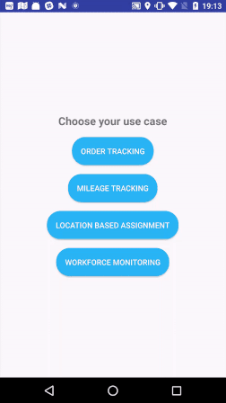

# HyperTrack Use Cases Sample Android app
[](http://slack.hypertrack.com)

This sample application implements tracking a User in the background as well as tracking a User on an Action. Read our [introduction](https://docs.hypertrack.com/) to know more.

This example application uses HyperTrack to enable following four use cases: 
1. **Order Tracking**: Build order tracking views in your product experience and business dashboards using [Actions](hypertrack.com/actions).
2. **Workforce Monitoring**: Build workforce monitoring of your fleet to power operational efficiencies.
3. **Mileage Tracking**: Build automatic mileage tracking for expense management of sales and service teams using [Actions](hypertrack.com/actions).
4. **Location-based Assignments**: Build location-based assignments for your on-demand business.

## Requirements
[Android Studio](https://developer.android.com/studio/index.html) with emulator (or test device)

## Clone Repository

#### Step 1. Clone this repository

You can skip this step if are building the usecase within your existing app.

```bash
# Clone this repository
$ git clone https://github.com/hypertrack/use-cases-example-android.git
```

**OR**

In Android Studio

**Goto File > New > Project from Version Control > Git**
Enter Enter Git Repository URL https://github.com/hypertrack/use-cases-example-android.git and Click on Clone.


#### Step 2. Signup and get Test Publishable key.
1. Signup [here](https://www.hypertrack.com/signup).
2. Get `test` publishable key from [dashboard](https://dashboard.hypertrack.com/settings) settings page.
3. Add the test publishable key to  [`UseCaseApplication.java`](https://github.com/hypertrack/use-cases-example-android/blob/mock_tracking/app/src/main/java/com/hypertrack/usecases/UseCaseApplication.java) file.
```java
HyperTrack.initialize(this.getApplicationContext(), TEST_PUBLISHABLE_KEY);
```

#### Step 3. FCM Integration
The SDK has a bi-directional communication model with the server. This enables the SDK to run on a variable frequency model, which balances the fine trade-off between low latency tracking and battery efficiency, and improve robustness. For this purpose, the Android SDK uses FCM or GCM silent notifications.

By default, project is configured with test `google-service.json` credentials.

You need to add FCM Server Key `AAAAckZ1H20:APA91bEyilv0qgVyfSECb-jZxsgetGyKyJGVIavCOLhWn5GdI0aQBz76dPKAf5P73fVBE7OXoS5QicAV5ASrmcyhizGnNbD0DhwJPVSZaLKQrRGYH3Bam-7WGe3OEX_Chhf7CEPToVw0` on HyperTrack [dashboard settings page](https://dashboard.hypertrack.com/settings).

**Note:**But if you want to use your FCM configuration then replace `FCM Server Key` on HyperTrack [dashboard settings page](https://dashboard.hypertrack.com/settings) with yours FCM server key and replace
[google-service.json](https://github.com/hypertrack/use-cases-example-android/blob/mock_tracking/app/google-services.json) .

#### Step 4. Sync Gradle
Sync the Gradle files to download the HyperTrack SDKs.

#### Step 5. Run Sample APP

Run directly on a test phone either by connecting to your computer or by creating an APK and then installing it manually.

**OR**

Run in emulator and pass location to emulator device using extended controls and settings dialog. Follow this steps for [more info](https://developer.android.com/studio/run/emulator.html#extended). 

## Testing (Mocking user Location)
A user’s tracking session starts with HyperTrack.startTracking() and ends with HyperTrack.stopTracking(). In order to mock user movement developers would call `HyperTrack.startMockTracking()` and `HyperTrack.stopMockTracking()` respectively.

[`HyperTrack.startMockTracking()`](https://docs.hypertrack.com/sdks/android/reference/hypertrack.html#void-startmocktracking) API starts a simulation from the device's current location to a nearby place of interest within a 5-10km radius so the session is long enough to test your app & its features.

Developer can simulate user's location to a particular destination location from a given source location.
```
public static void startMockTracking(@NonNull LatLng sourceLatLng, @NonNull LatLng destinationLatLng, @Nullable HyperTrackCallback callback);
```

## Walk through:


1. App ask for location permission and location service.
2. App creates user on HyperTrack Server using `HyperTrack.getOrCreateUser` API and configure that user on the device.
3. After user configured in device SDK starts mock tracking that device location and activity data.
4. Now you can see all the data related to user on the HyperTrack [dashboard](https://dashboard.hypertrack.com/).

## Documentation
For detailed documentation of the methods and customizations, please visit the official [docs](https://docs.hypertrack.com/).

## Contribute
Please use the [issues tracker](https://github.com/hypertrack/use-cases-example-android/issues) to raise bug reports and feature requests. We'd love to see your pull requests - send them in!

## Support
Join our [Slack community](http://slack.hypertrack.com) for instant responses, or interact with our growing [Community](https://community.hypertrack.com). You can also email us at help@hypertrack.com.

